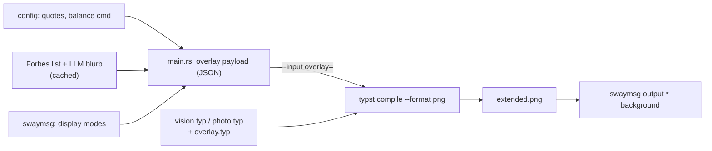

# Architecture

Renders a wallpaper: a background (the vision document, or an arbitrary photo) with a quote,
a balance readout and billionaire trivia laid over it, then hands it to sway.

## Codemap

**`src/main.rs`** — the whole of the Rust side. Gathers data (config, Forbes, safe area),
serializes it, invokes `typst`, sets the wallpaper. `compile_wallpaper` is the only place that
shells out to typst.

**`src_typ/`** — layout. `overlay.typ` decodes the payload and exports `overlay()`, `page-size`
and `inset`; `vision.typ` is the goal document with `overlay()` appended to its flow;
`photo.typ` is a bare page with a photo background and the overlay placed top-right.

## Invariants

- **Typst owns all layout.** Rust never positions, measures, wraps or rasterizes text. Two layout
  engines cannot agree on coordinates, which is how the overlay used to paint over the document.
- **Overlap is impossible by construction, not by bookkeeping.** On the vision path the overlay is
  flow content. If it stops fitting, typst emits a second page and the run fails loudly — there is
  no configuration in which it silently covers something.
- **One payload, one hand-off.** Everything typst needs arrives as a single `--input overlay=<json>`.
  Adding an information source is a new JSON field, never a new file or a new argument.
- **A decoration must never cost the wallpaper.** Forbes and the LLM blurb are best-effort; every
  other failure aborts the run rather than rendering something wrong.
- **The page is 1920pt wide, always.** Height follows the display's aspect ratio and `--ppi` scales
  the raster to its resolution, so text keeps the same relative size on every screen.
- **Everything renders inside the safe area** — the region visible on *all* active displays under
  sway's `fill` — passed to typst as extra page margins.
